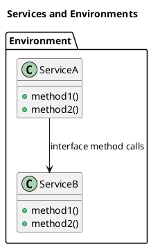
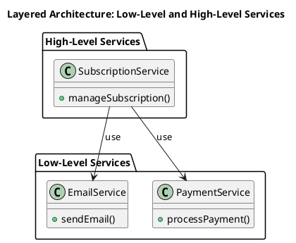
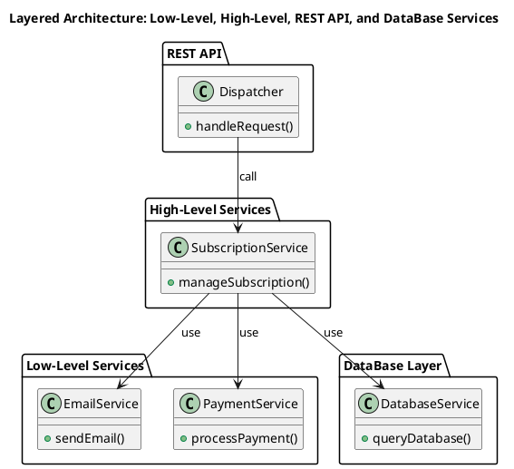
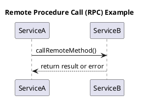
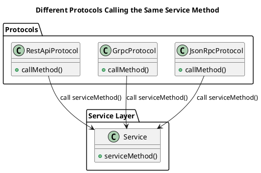
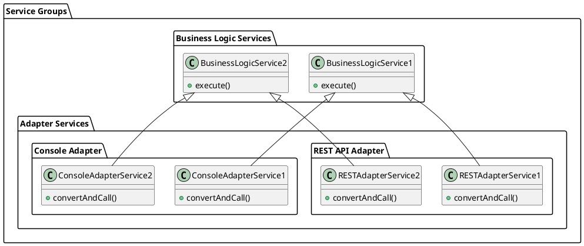
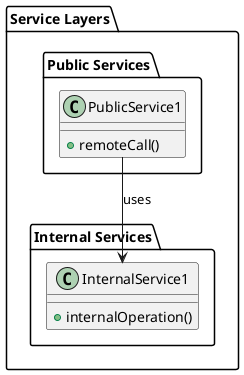

# Architecture

## Services and Environments

A `service` is a module instantiated within an `environment` that implements logic.

In `PHP`, `services` are typically implemented as classes, 
and interactions are organized through public interface methods.

Services usually interact with each other.

An `environment` consists of multiple services instantiated once, 
which interact with each other through interfaces.



There cannot be two copies of the same service within a single environment.

`Services` find each other through `dependency resolution`. 
Thus, when a service is instantiated, it gets its dependency services 
that are in the same `environment` as the service.

This concept allows considering an application as a collection of services interacting with each other. 
The concept of environments provides an additional way to group services.

## Layered Architecture Organization

You can organize a `horizontal` `layered` architecture using environments and services, 
considering a layer as an environment.

For example,
You can separate low-level services from services that implement business logic, 
as shown in the diagram:



In this example, the `Low-Level Services` environment contains services that implement low-level logic,
such as sending emails and processing payments.
The `High-Level Services` environment contains services that implement business logic, 
such as managing subscriptions.

This code organization is useful because services from a dependent environment 
cannot be linked to a high-level environment without "hacks." 
Additionally, explicit grouping of services helps developers see which service belongs to which layer.

Now we can consider the overall architecture of the application in the following diagram:



In this diagram, the `REST API` environment contains services that handle incoming requests.
The `High-Level Services` environment contains services that implement business logic.
The `Low-Level Services` environment contains services that implement low-level logic.
The `DataBase Layer` environment contains services that interact with the database.

## Principle of Minimal Dependency for the Business Logic Layer

`Clean architecture` advocates for the principle of minimizing the dependency of the business logic layer on other components. 
Ideally, the business logic layer should not depend on anything at all. 
We can adhere to this principle by using dependency inversion and grouping services.

In practice, this means we should strive for the following principles:

1. Business-level code should be a single entry point, 
without additional adapters, helper classes/components.
2. Business-level code should not depend on the API layer.

To achieve this, we will consider services, 
their interfaces, and methods as a universal `RPC model`, 
where interactions with services can be viewed as remote procedure calls.

## RPC Model

An abstract RPC model consists of services and procedures that can be called remotely.



In this model, `ServiceA` calls a method on `ServiceB` and receives a result or error.

To perform a remote procedure call, the following knowledge is required:

1. You need to know which service contains the method.
2. You need to know the information about what parameters can be passed 
to the remote procedure and in what format.

Imagine that we can have multiple implementations of parameter transmission protocols, 
different types of parameter encoding, 
and various ways of delivering results. 
In this case, we can describe interactions with services as interactions between 
different protocols, which differ in implementation details but provide the same way of calling the same procedure.



## Principle of Unified (single source) Description

To achieve the goals described above, 
we must enable the description of RPC interactions in such a way 
that information about data formats and encoding methods can be extracted from a single source. 
Since a service method is a regular class method, 
this means that a regular PHP class method should become 
the single source of description for a remote RPC call.

This means that the definition of a service method 
should include information about data types that correspond to business logic rather than the programming language level. 
For example:

```php
class Service {
    public function serviceMethod(string $uuid, int $timestamp): bool
    {
        // method implementation
    }
}
```

The method below contains a parameter of type UUID, 
which is passed as a string. 
If we write the method in this way, the information about the data type will be lost.

Therefore, we must use **SPECIFIC** data types that reflect the business logic rules:

```php
class Service {
    public function serviceMethod(Uuid $uuid, Timestamp $timestamp): bool
    {
        // method implementation
    }
}
```

In this case, the `Uuid` and `Timestamp` classes are specific classes that reflect the business logic rules.

## Separation Public and Internal

We propose structuring the application by dividing all services into two main groups:

* **Public** services, which are available for remote calls.
* **Internal** services, which are accessible only within the application.

Why exactly two groups? 
Why not three or four? 
Why isn't one group enough?

Having three or more groups of services can greatly complicate the application's architecture
and the programmer's interaction with the code. 
In other words, the programmer would need to keep track of the number of groups/layers 
of services and think through their interactions. 
This task is not trivial, and it is difficult to come up with an example where such a structure would be truly justified.

Since access to all services is determined through an access control system, 
why not use just one group of services? 
That is, place all services in a single space?

For many simple projects, such a service structure would likely be sufficient, and separating services into public and internal might not make sense. But let's consider an example.

Suppose you have a service that returns the string "Hello World, Name". 
The service takes a name as input and returns a string with the name. 
Let's say you use the service in two different environments:

* In a `REST API` environment.
* In a `Console` environment.

In the `REST API` environment, you need to specify a path where the URL will be transformed into a remote call. 
You need to determine how the name parameter will be passed, as `REST API` has several methods for this.
In the `Console` environment, it might also be important to define the command name that will be translated into a service call.

You can achieve this by adding attributes to the service. 
However, this would break the encapsulation of the service, 
as it would now contain information about a specific implementation. 
This isn't necessarily a bad thing, as there are situations where you need to write code quickly.

You can also create special services that will call the target service. 
These special adapter services will convert data and hide the implementation details 
of a specific environment from the business logic service.



In other words, two main groups of services emerge:

* Services that ensure interaction between the environment and the service where the business logic is implemented.
* Services that implement pure business logic without the environment's implementation details.

This structure aligns well with the principles of clean architecture.

Since there can be multiple execution environments, 
the number of adapter service groups can match the number of environments.



### Two approaches to organizing Public and Internal services.


This library offers two approaches for organizing the Public/Internal services scheme:

* A separate scheme, where internal services are registered in their own ServiceLocator, and public services in their own.
* A unified service storage.

The difference is that the separate scheme requires explicitly defining adapter services for external interactions.
The unified storage allows you to use brute force and declare pure business logic services as public if needed.
In other words, the second scheme encourages writing "dirty code."
In the first scheme, the programmer will be required to literally create two classes for two services:
the business logic service and the adapter service.

For most projects, the second scheme will be preferable, as it helps to write code faster.

## Services and Infrastructure

Services that provide interfaces to the infrastructure should generally not be located in the 
Public zone and are considered internal. 
If required by the project, 
you may choose to separate them into a dedicated storage.

In most cases, it's difficult to come up with a scenario where infrastructure services need 
to be separated into a different space. 
Therefore, infrastructure services share the Internal space with services that implement business logic, 
and their separation is only reflected at the file and directory structure level.