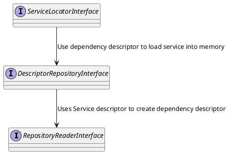

# Service Repository

A service repository is a collection of services grouped by the following criteria:

* `Service name` — a unique name identifying the service as a distinct functionality provider.
* `Package` — the name of the package the service belongs to (or Bundle for Symfony).
* `Runtime tags` — an array of strings specified at application startup, assisting the service manager in loading only the necessary services.

The following statements are true:

* Multiple different services **can have** the **same name** in the registry.
* **Only one** service with a given **service name** can be loaded into the environment.
* A single package can have multiple services with the same name.

The following contracts are defined for interaction with the service registry:

`RepositoryReaderInterface` – provides reading of service descriptors to be loaded into the Environment. 
This interface organizes access to services by their unique service names.

`ServiceCollectionInterface` – provides access to all service descriptors in the service registry. 
Unlike the previous interface, it does not restrict access.

`ServiceCollectionWriterInterface` – allows manipulation of service descriptors in the registry, 
enabling modification of the service registry state. It can activate or deactivate services.

The contracts described above are the lowest level, literally defining agreements on 
how the service configuration is read. 
The next level of abstraction is provided by the `DescriptorRepositoryInterface` contract.

`DescriptorRepositoryInterface` uses the `RepositoryReaderInterface` to construct a service descriptor 
as a Dependency Injection dependency, which can then be resolved and subsequently 
loaded into memory.

The next level of abstraction is the `ServiceLocatorInterface` contract, 
which provides a way to access services by bindings as `DependencyContainer`.

